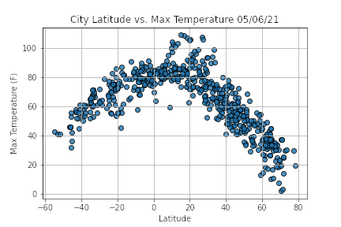
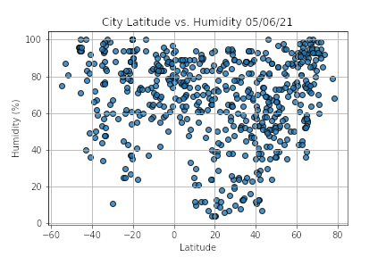
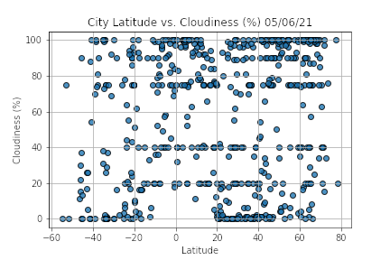
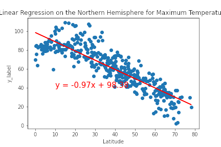
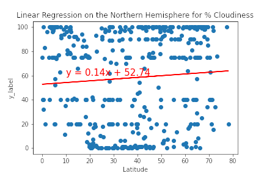
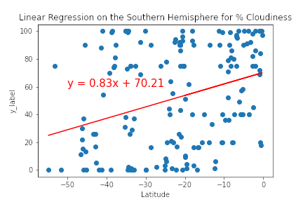
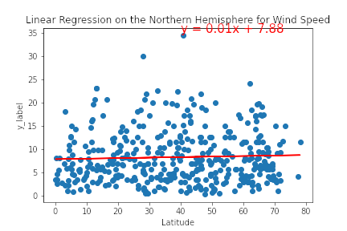
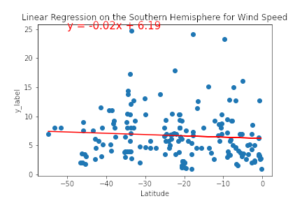

# World Wide Weather Project

## Initial Analysis

WeatherPy.ipynb contains the initial creation of a weather database using randomly generated lat-long pairs and the OpenWeatherMap API. The weather data was then plotted to show the associations between latitude and Temperature, Humidity, Cloudiness, and Windspeed, seen below.

 

The correlation between these variables was then quantified via linear regression:
#### Maximum Temperature

#### Percent Humidity

#### Percent Cloudiness

#### Wind Speed

## Applying Weather Data to Build a Search Filter and Itinerary

The weather_database directory generates a new randomized set of lat-long pairs, matches them to cities, retrieves weather data, and stores it all in a dataframe (exported as CSV). 

The next step (in the vacation_search directory) was to build a  map which would display with hotel locations in cities that meet the input criteria. To do this, I set the program to receive information on maximum temperature, then pulled in the google maps API to locate hotels in the cities that were filtered from the main database. I then built pop-up info box markers to provide information about the Hotel name, location, weather description, and maximum temperature in Fahrenheit.

The final step (located in the vacation_itinerary directory) was to build a trip itinerary that shows the route between 4 cities that were chosen from the possible destinations defined in the previous search. I created a small loop through 4 cities in Japan, included a "directions" layer from gmaps, as well as the same infobox from before.

